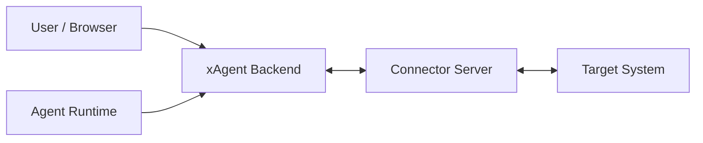

# xAgent Connector Architecture

本文档定义 xAgent Connector 的架构边界、事实归属和生命周期。HTTP endpoint、WebSocket packet、JSON 字段、状态枚举和第三方实现要求见
[xAgent Connector Common Protocol](xagent_connector_protocol.md)。

不同能力的消息、状态和实现建议由独立 Profile 规范定义：

- [xAgent IM Profile v1](profiles/xagent_im_v1.md)
- [xAgent IM Profile v2](profiles/xagent_im_v2.md)
- [xAgent Device Profile v1](profiles/xagent_device_v1.md)

## 1. 定位

Connector 是运行在 xAgent 进程外的外部系统桥接服务。它负责把目标系统的登录态、消息、文件和操作能力投影成 xAgent 可治理的连接、事件和工具。

Connector 不是普通 Skill，也不是 xAgent 内部插件：

- Skill 只告诉 Agent 如何理解事件、如何使用工具。
- Connector Server 持有目标系统协议和登录态。
- xAgent 持有系统级接入事实、用户到 Connector channel 的归属索引、工具投影和 SessionEvent 转换。



## 2. 事实边界

| 角色 | 拥有事实 | 不拥有 |
| --- | --- | --- |
| xAgent | Connector catalog、`server_base_url`、系统 API key、Connector Card/Skill 缓存、`connector_id`、用户与 `connector_channel_id` 的归属索引、WebSocket 路由、Agent 工具投影、SessionEvent 转换、本地治理策略 | 目标系统登录态、目标系统 token、目标联系人事实、Connector 内部队列、Connector 文件映射 |
| Connector Server | `connector_id` 分配和校验、`connector_channel_id` 分配、目标系统登录态、目标系统权限、Connection Descriptor、工具执行、入站消息缓存、文件引用、目标系统协议细节 | xAgent 用户权限体系、xAgent 会话治理策略、Agent 内部执行流程、xAgent 持久化 schema |
| Agent / LLM | 当前会话可见工具、Connector Skill、用户可见消息正文、业务参数 | 系统 API key、`connector_id`、`connector_channel_id`、目标系统 token、transfer token、WebSocket packet |

边界原则：

- `server_base_url` 归 xAgent connector catalog 管理，不写入 Connector Card，也不由 Connector 本地配置决定公开访问根地址。
- `connector_card_id` 和 Connector 展示名是 Connector 开发时确定的稳定协议常量，不应由部署者运行时改名。
- 目标系统登录态只在 Connector 内。
- xAgent 只保存 Connector 分配的 ID 和必要投影。
- Connector 不理解 xAgent 的完整用户权限模型，只服务 xAgent 打开的 `connector_channel_id`。
- xAgent 不解析目标系统私有协议，例如微信 iLink、OAuth provider API、IMAP 细节。
- `connector_channel_id` 是路由和绑定索引，不是鉴权凭证。

## 3. 核心模型

### 3.1 BaseConnector

BaseConnector 是 xAgent 系统级 connector catalog 事实。

它由 `connectormanageservice` 写入，包含：

- `connector_card_id`
- `connector_id`
- `name` / `version` / `vendor`
- `server_base_url`
- 加密落盘的系统 API key
- protocol / protocol version
- Connector Card 快照
- health 状态和最近错误摘要

BaseConnector 不包含目标系统账号、token、联系人或用户登录态。

### 3.2 Connector Card

Connector Card 是 Connector 未绑定前的静态能力声明。

它回答：

- 这个 Connector 是什么。
- 稳定 `connector_card_id` 是什么。
- 支持哪些 target type、target provider 和 profile。
- 有哪些真实存在的工具。
- 有哪些认证流程。
- xAgent 如何生成基本登录 UI。

Card 不表达某个用户是否已经登录，也不表达某个 channel 当前工具是否可用。

### 3.3 ConnectorClient

xAgent 为每个 `connector_card_id` 维护一个系统级 ConnectorClient。

同一个 xAgent 实例中，一个 `connector_card_id` 只能登记一个 Connector Server 连接。新增连接在 connectormanageservice 内先按 Card ID 检查并串行写入；编辑已有连接继续使用原 Connector 主键，禁止第二条同 Card 配置覆盖或并存。

ConnectorClient 持有：

- HTTP client，用于读取 Card、Skill、health 和 transfer endpoint。
- WebSocket data plane。
- outbound send queue。
- 当前 `connector_id`。
- 活跃 `connector_channel_id -> user/session/runtime` 路由。

页面刷新、状态读取、工具调用和重连必须复用同一个 ConnectorClient，不能各自创建 WebSocket 线路。

### 3.4 connector_id

`connector_id` 是 Connector Server 为当前 data plane 握手分配的运行实例 ID。

规则：

- 首次 WebSocket `connector.hello` 时 xAgent 可传空。
- Connector 返回 `connector.hello.ack` 并告知当前 `connector_id`。
- xAgent 按稳定的 `connector_card_id` 找到唯一 ConnectorClient，并保存当前运行实例 ID。
- 后续连接可以携带最近一次 `connector_id`，但 Connector Server 清理状态或重建后可以重新签发。
- 同一 `connector_card_id` 返回新的 `connector_id` 时，xAgent 原子替换整套 ConnectorClient 并关闭旧实例；不得在旧 DataPlane 上改写 ID，也不得据此创建第二条 Connector catalog 记录。

`connector_id` 不是 `connector_card_id`。

#### Connector Server 离线租约

Connector Server 必须把 xAgent data plane 在线状态作为 `connector_id` 的运行租约管理：

- 当前 `connector_id` 的最后一条已完成 hello 的 WebSocket 断开后开始计时；一小时内以同一 `connector_id` 重连会取消本次过期。
- 连续离线满一小时后，Connector Server 注销该 `connector_id`，后续 hello 必须重新建立运行实例。
- `connector_id` 注销会触发其下属 Channel 的强制注销；这条超时治理规则会清理 Connector 内目标系统登录态，不等同于用户主动发送 `channel.close`。
- Channel 注销是独立动作，必须逐个走对应 provider 的登出和持久化清理路径。
- Telegram `bot_token`、飞书 `app_id` 等共享底层消费实例按目标凭据独立维护引用；最后一个 Channel 引用移除后必须同步停止，仍有引用时不得停止。
- Connector Server 重启并恢复了持久 Channel，但一小时内没有任何 xAgent data plane 完成 hello 时，这些 Channel 也按无运行实例归属处理并注销。

这三层的 owner 分别是 Connector Server 运行实例、Connector Channel 和 provider 共享消费实例。上层注销可以依次触发下层检查，但下层不得依赖上层定时器代替自己的引用判断。

### 3.5 connector_channel_id

`connector_channel_id` 是 Connector 在稳定 `connector_card_id` 命名空间下分配的用户级持久 channel ID。

规则：

- xAgent 首次打开用户 channel 时发送空 `connector_channel_id`。
- Connector 分配并返回新的 `connector_channel_id`。
- xAgent 持久化 `user_id + connector_card_id + connector_channel_id` 归属索引。
- xAgent 重启后会重新打开已持久化且仍有效的 channel。
- Connector 可以在无法识别旧 channel 时重新分配 channel；xAgent 收到新 ID 后更新原用户绑定。
- xAgent 与 Connector 的 Channel 路由只使用 packet envelope 顶层的 `connector_channel_id`；`UserConnector.ID` 和用户归属只留在 xAgent 内部映射。
- `tool.invoke.payload.context` 当前可以携带 `session_id` 和 `tool_call_id` 作为调用关联信息；它们不是 Connector 身份、Channel 路由或鉴权依据。
- Connector 使用同一个 `connector_channel_id` 映射目标账号、平台会话和运行态属性，不使用 xAgent 内部主键做业务归属。
- `connector_channel_id` 以稳定的 `connector_card_id` 为归属命名空间，不随 Card 当前对应的 `connector_id` 变化；运行实例替换后 xAgent 用原 Channel ID 恢复路由。

### 3.6 Connection Descriptor

Connection Descriptor 是绑定后的用户级动态投影。

它回答：

- 当前 channel 绑定到哪个目标系统身份或资源。
- 当前 connection 状态是什么。
- 当前实际启用了哪些标准和扩展 Profile。
- 当前哪些 `tool_id` 可用。

Descriptor 只描述当前 channel，不描述 Connector 全局能力。`connection.profiles` 必须是 Card `supports.profiles` 的非空子集；Card 中没有的工具不能出现在 Descriptor 中，Descriptor 中不可用的工具不能投影给 Agent。

### 3.7 Connector Skill

Connector Skill 是 Connector 给 Agent 的运行时说明。

它回答：

- 入站事件应该如何理解。
- 回复或处理时应该使用哪个工具。
- 工具参数应该如何填写。
- 哪些行为不能伪造。

Skill 不保存状态，不包含密钥，不替代 Card 或 Descriptor。

## 4. 三个通信平面

### 4.1 Control Plane

Control Plane 是系统级 HTTP 读取和健康检查。

它负责：

- 读取 Connector Card。
- 读取 Connector Skill。
- 探测 Connector health。

Control Plane 不执行用户级工具，也不传文件正文。

### 4.2 Data Plane

Data Plane 是 WebSocket packet bus。

它负责：

- 系统级 `connector.hello`。
- 打开和关闭用户 channel。
- 用户认证流程。
- descriptor 同步。
- `tool.invoke`。
- 入站 `message.push`。
- 声明 `xagent.im.v2` 后的 `chat.message`、`chat.message.delta`、`chat.message.ack` 和 `chat.activity`。
- `ping` / `pong` 和错误回包。

Data Plane 只传结构化 packet，不传文件正文、base64 或目标系统 CDN 字节流。

`xagent.im.v2` 是 `target_type=im` 的 Data Plane Profile，不是第四个通信平面。它传输完整聊天消息、assistant 实时文本增量、接收确认和脱敏活动状态；完整消息可以携带 Transfer Plane `file_ref`，但不能携带文件字节。interrupt、approval、pending 与 Browser Runtime 信令不属于 IM v2。xAgent 内部的 Session 同步、历史回放和 UI 投影不属于 Connector 扩展能力，不得通过任何 Connector Profile 转发。Connector 必须同时处理可能出现的 assistant 增量和最终消息；原生支持流式展示时可以实时更新目标消息，不支持时在本地缓存增量并在最终消息到达后一次性发送。文件只随 final 到达。

#### Connector 虚拟消息通道边界

xAgent 为协商成功的实时消息 Profile 注册虚拟消息通道，只是为了把 Connector 接入与其它实时消息入口相同的 Brain 处理链。IM Connector 使用 `xagent.im.v2`；Browser Runtime 使用自身的版本化 Profile。该虚拟通道是传输适配器，不是 UI Channel，也不是通用 Session 客户端。

必须遵守：

- Connector -> xAgent 的 `chat.message` 只表示一条新的用户输入；完成前置校验和路由后，直接进入当前 Session 的统一 Brain 处理链。
- Connector -> xAgent 的图片、视频、音频和普通文件先按 `download_url` 登记为统一文件，再作为普通文件块随同一用户消息进入 Brain；Connector 内部上传引用不得进入提示文本、Skill 或模型工具参数。
- xAgent -> Connector 的 `chat.message.delta`、最终 `chat.message` 和可选 `chat.activity` 只来自当前实时执行；每条新落库的 assistant 消息都以自己的最终 `chat.message` 完成，不受它位于工具调用前后影响。这里的“最终”表示单条消息完成，不表示整个 Agent/tool loop 只能发送最后一条回复。消息投递不能由 Session 历史查询、历史遍历或同步投影触发。
- xAgent -> Connector 的 assistant 文件块先通过 Transfer Plane 上传，最终 `chat.message.files` 只携带 Connector 返回的引用；文本和全部文件共用一个 `message_id` 和 ack 生命周期。
- `session.sync_request`、`session.sync_message`、`session.sync_end` 以及等价的历史、快照、回放和 UI 投影只能服务 xAgent 自己的 UI/Session Channel，不能写入 Connector 虚拟消息通道。
- 虚拟消息通道重连只恢复当前 `connector_channel_id` 的实时路由和未完成投递，不主动回放已经完成的 Session 消息。
- Connector 虚拟消息 packet 不接收 `SessionID`、`UserConnector.ID`、内部消息角色或历史游标；这些事实由 xAgent 保留，并通过当前 Channel 绑定完成内部路由。`tool.invoke` 单独允许在 `payload.context.session_id` 中携带非权威关联信息。

ChannelService 必须在写入传输前区分 UI 会话投影与 Connector 实时消息，不能依赖 Connector 收到内部 Envelope 后自行忽略。协议层为全部标准 Profile 提供结构化能力目录，统一声明 packet、方向、路由边界和允许的 xAgent 出站 `PayloadType`；协商完成后加载交集对应的数据形成不可变查询对象。Connector 虚拟消息通道只能查询该对象，不能硬编码 Profile 开关或信令白名单；Descriptor 的协商 Profile 变化时必须替换通道并重新加载。未列入目录和当前协商结果的信令由虚拟通道静默过滤。ConnectorManageService 只拥有 Connector 传输、确认和重试状态，不拥有 Session 历史事实。

内置 Browser Runtime 使用独立的版本化物理连接协议。当前客户端通过 Envelope v2 与 `protocol_version: "2.0"` 建立连接，xAgent 继续接受未声明版本的 Envelope v1 客户端；Connection Descriptor 只投影当前连接实际支持的 Browser Runtime Profile，不声明 `xagent.im.v2`。Browser Runtime v1/v2 自己拥有所需的 `chat.message`、`chat.message.delta` 和 `chat.message.ack` 路由；v2 额外通过 `browser.chat.message.snapshot` 接收同一 assistant 消息的正文、思考过程与流式状态完整快照。

### 4.3 Transfer Plane

Transfer Plane 处理文件、图片、视频等字节流。

它负责：

- xAgent 后端向 Connector 上传待发送文件，换取 `file_ref`。
- xAgent 后端从 Connector 下载入站文件。
- Connector 管理 `file_ref -> 目标系统文件/本地缓存` 的映射和过期策略。

前端、Agent 和 LLM 只持有 xAgent 统一 `file_ref`，不能直接持有 Connector 内部上传引用、系统 API key、目标系统 CDN token 或临时下载密钥。

## 5. 标准生命周期

### 5.1 接入 Connector

```text
Admin 输入 Connector Base URL 和可选 API key
xAgent 拉取 /connector-card.json
xAgent 拉取 /skill.md
xAgent 探测 /health
xAgent 保存 BaseConnector、Card 快照和 Skill 缓存
xAgent 注册 Connector 工具 runtime
```

接入阶段只建立系统级 Connector 事实，不自动创建用户 channel。

### 5.2 建立系统连接

```text
xAgent 打开 /ws data plane
xAgent -> connector.hello(connector_card_id, connector_id?, protocol_version, supported_profiles)
Connector -> connector.hello.ack(connector_id, protocol_version)
xAgent 校验并保存 connector_id
```

`connector.hello.ack` 完成前不能发送用户级 packet。

Connector 以 `supported_profiles` 与 Card 静态能力的交集决定逐 Channel 实际启用的 Profile，并通过 Connection Descriptor 返回结果；旧 xAgent 未声明该字段时不能被动启用新增 Profile 信令。

### 5.3 打开用户 channel

```text
User 点击连接
xAgent -> channel.open(connector_channel_id = "")
Connector -> channel.open.ack(connector_channel_id, connection_descriptor)
xAgent 暂存未认证 Channel 运行态
xAgent -> auth.start / auth.status
Connector -> authenticated + connection_descriptor
xAgent 创建 UserConnector 与专属 Session 聚合
```

首次创建时，`channel.open` 只建立临时认证上下文，不写入 UserConnector 表。认证取消或弹窗关闭时，xAgent 关闭临时 channel 并释放上下文；只有认证成功并取得 `connection_descriptor` 后才落盘 Channel 与专属 Session。

如果用户已有持久化 channel，页面只提交 `UserConnector.ID`。xAgent 以该主键读取最新记录，按记录中的 `connector_card_id` 解析当前 Connector，再带数据库中的 `connector_channel_id` 重新 `channel.open`。Connector 能识别则复用，不能识别则重新分配并返回新 ID；xAgent 始终更新原 UserConnector 主键，不创建第二条记录。

### 5.4 用户认证

认证必须在已打开 channel 上进行。

```text
xAgent -> auth.start(flow_id)
Connector -> auth.start.ack(...)
xAgent -> auth.status(auth_session_id, refresh?)
Connector -> auth.status.ack(...)
Connector -> connection.descriptor.push(optional)
```

认证状态属于认证流程，Connection Descriptor 的 `connection.status` 属于用户连接投影。最终 UI 状态以最新 Descriptor 回正。

`auth.cancel` 只取消未完成的认证会话，不等于登出目标系统。

### 5.5 工具调用

```text
Agent 调用 connector tool
xAgent 根据当前用户和 channel 封装 tool.invoke
Connector 执行目标系统操作
Connector -> tool.invoke.ack(result or error)
```

工具调用中：

- `tool_id` 必须来自 Connector Card。
- 官方 Connector 构建 Card 时会把必填的 `connector_channel_id` 注入工具输入 schema，因此 LLM 可以看到并填写该字段。
- xAgent 当前不使用模型参数中的 `connector_channel_id` 选择 Channel：Connector 专属 Session 优先使用固定绑定；没有专属 Session 绑定时，从同一 Connector Card 的已认证可用 Channel 中采用第一个提供该工具的 Channel。
- xAgent 把实际选中的 Channel ID 写入 packet envelope；模型 arguments 当前原样进入 `payload.arguments`，其中的 `connector_channel_id` 不覆盖 envelope 路由。
- Connector 只按 envelope 顶层 `connector_channel_id` 路由，业务工具不消费 arguments 中的同名字段。
- Connector 必须按当前 channel 的目标系统权限校验工具是否可用。
- 业务失败返回 `tool.invoke.ack.error`。
- 协议、身份、路由错误返回 `type = error`。

### 5.6 入站消息

Connector 负责从目标系统接收消息，并推给 xAgent。

```text
Connector 从目标系统收到消息
Connector 按 Profile 的投递语义接管消息
如果 channel 已打开，Connector -> xAgent
xAgent 按公开 packet 返回接收结果
Connector 按接收结果结束、重试或等待过期
```

Connector 拥有目标系统消息的接管、重投和过期责任，但协议不规定必须使用本地文件、数据库或消息队列。当前 IM 消息的外部保证和建议策略见 [xAgent IM Profile v2](profiles/xagent_im_v2.md)；[IM Profile v1](profiles/xagent_im_v1.md) 只用于旧 `message.push` 兼容。

### 5.7 关闭和登出

`channel.close` 和 `auth.logout` 是两个不同动作：

- `channel.close` 只关闭当前运行时 channel 路由，不删除 xAgent 持久化绑定，也不删除 Connector 内目标系统登录态。
- `auth.logout` 要求 Connector 清理目标系统登录态；xAgent 在成功后保留 UserConnector 与专属 Session，更新为未认证并删除运行时路由，供用户下次编辑认证信息后再次认证。
- 彻底删除 UserConnector 与专属 Session 是独立的显式删除动作，不属于登出语义。

## 6. Card、Descriptor、Skill 的关系

三者职责不能混用：

| 对象 | 性质 | 生命周期 | 内容 |
| --- | --- | --- | --- |
| Connector Card | 静态能力清单 | 接入时读取，版本变化时刷新 | connector 身份、target/profile、auth flow、真实工具 schema |
| Connection Descriptor | 用户级运行态投影 | channel.open/auth/status/push 时刷新 | 当前 channel 状态、目标账号展示、工具可用性 |
| Connector Skill | Agent 行为说明 | 接入时下载，版本变化时刷新 | 如何处理事件、如何使用工具、禁止伪造什么 |

## 7. 工具投影

Connector 工具是动态 runtime 投影，不是全局永久工具。

xAgent 投影流程：

1. 从 Connector Card 读取工具定义。
2. 从 Connection Descriptor 读取当前 channel 的工具状态。
3. 叠加 xAgent 本地治理策略。
4. 只把当前用户、当前会话可用的工具注入 Agent runtime。

规则：

- Connector 提供的工具必须真实存在。
- 不允许把未来可能支持、但当前调用会 404 的能力放进 Card。
- 不允许伪造联系人搜索、文件搜索等目标系统不存在的工具。
- LLM 看到的是 `tool_id + description + schema`。
- 官方 Connector 工具 schema 包含模型可见的 `connector_channel_id`；系统 API key 和目标系统 token 始终不可见。
- 当前 Session 绑定 Connector Channel 时只使用该绑定；没有绑定时，xAgent 遍历当前用户可用 Channel 并采用第一个匹配 Connector Card 且提供该工具的 Channel。

## 8. 入站消息模型

Connector 只需要按公共协议和已声明 Profile 输出消息，不需要理解 xAgent 内部 Session、Agent 或事件模型。

`message.push` 的公共 packet 结构由主协议定义，[xAgent IM Profile v1](profiles/xagent_im_v1.md) 仅用于 xAgent 兼容旧 Connector。当前 IM Connector 使用 [xAgent IM Profile v2](profiles/xagent_im_v2.md) 传输双向 final、delta、ack、activity 和文件引用，并声明 IM 工具归属。

## 9. 文件和资源引用

Connector 文件模型：

```text
目标系统文件 / Connector 本地缓存
  -> file_ref
  -> download_url
  -> xAgent ResourceRef
  -> session attachment / workspace file
  -> Agent 可读文件
```

规则：

- 入站文件由 Connector 尽早下载或缓存，避免目标系统 CDN 过期。
- `file_ref` 是 Connector 内部不透明 key。
- `download_url` 可以是绝对 URL，也可以是相对 URI；相对 URI 由 xAgent 用 catalog 中的 `server_base_url` 补全。
- `download_url` 只能由 xAgent 后端或资源解析器消费。
- xAgent 可以把 Connector 文件解析成本地 session file，再作为普通文件进入多模态模型请求。
- xAgent 可以把 assistant 消息中的 session file 上传给 Connector，并在最终 `chat.message.files` 中引用返回的 `file_ref`。
- 大文件不走 WebSocket，不走 tool 参数，不走 base64。

语音消息属于 Connector 语义判断：

- 如果目标系统已经给出语音转文字，Connector 可以作为文本消息推送。
- 如果目标系统不能解析，Connector 不应强迫 xAgent 做 ASR；可以按普通文件或不可解析事件处理。

## 10. 状态、缓存和恢复

xAgent 持久化：

- BaseConnector。
- Connector Card 快照。
- Connector Skill 缓存。
- `connector_id`。
- `user_id + connector_card_id + connector_channel_id` 归属索引。
- 最近一次用户认证状态、激活状态和错误摘要，用于 UI 初始展示和回正触发。

xAgent 不持久化：

- 首次 `channel.open` 后、认证成功前的临时 Channel 认证上下文。
- 目标系统登录态。
- 目标系统 token。
- Connection Descriptor 作为目标系统长期事实。
- 目标系统联系人事实。
- Connector pending message 队列。
- Connector 文件映射事实。

Connector 拥有：

- 目标系统登录态或授权材料。
- `connector_card_id + connector_channel_id` 到目标身份的持久绑定，以及当前 `connector_id` 对这些 Channel 的运行时连接所有权。
- 入站消息的保留、重投、过期和容量策略。
- 目标系统消费游标或等价的消息重放能力。
- 文件 `file_ref` 映射和本地缓存路径。

Connector 可以使用本地存储、外部数据库、消息队列或目标系统自身的可靠游标实现这些责任。具体 TTL、容量、清理周期和内部并发模型由对应 Profile 提供建议，不属于通用 wire contract。

恢复规则：

- xAgent 重启后，按持久化 UserConnectorState 并发恢复有效 channel。
- Connector 重启后必须恢复跨边界仍然有效的目标系统身份和 channel 绑定；消息是否以及如何恢复由已声明 Profile 的外部保证决定。
- channel 未打开时，Connector 不能把消息误判为已成功投递。
- 需要保留消息的 Profile 必须定义有限的过期和容量语义，但不规定具体存储实现。
- xAgent data plane 会自动重连；连续失败达到上限后停止自动重试，等待用户或管理员动作触发恢复。

## 11. 安全约束

必须遵守：

1. 系统 API key 只存在于 xAgent 后端和 Connector Server 之间。
2. 目标系统 token 只存在于 Connector 内。
3. 前端、Agent、Skill、Card、Descriptor、tool 参数、message payload 都不能包含系统 API key 或目标系统 token。
4. `connector_channel_id` 和 `request_id` 都不是鉴权凭证。
5. Connector 必须校验系统连接身份、`connector_id`、`connector_channel_id` 和工具权限。
6. Connector Card 可以公开，但不能包含密钥、一次性二维码、OAuth state、目标系统登录态或真实敏感身份。
7. Connection Descriptor 只能包含展示级账号信息和脱敏提示。
8. 有副作用工具必须具备幂等或重复调用识别能力。
9. Connector 返回的工具结果不得携带目标系统 token、bot token、context token 或 API key。
10. 日志不得记录系统 API key、目标系统 token、临时下载密钥或目标系统 CDN 签名原文。

## 12. 版本和兼容

`connector.version` 表示 Connector Card 和 Connector 自身能力版本。

Protocol version 表示 xAgent Connector 协议版本。

兼容规则：

- Connector Card 只声明 Connector 自身当前 `protocol_version`；最低兼容版本是 xAgent 本地准入策略，不进入 Card。
- xAgent 仅接纳位于自身最低兼容版本与当前版本之间的 Connector；hello 互报当前版本，不交换版本列表。
- 底层解析器仍能识别缺省 `protocol_version` 的旧对象，并能把 v1 Connection Descriptor 归一化为当前 `Profiles []string` 内部模型。
- 当前 catalog 和官方 Connector 都拒绝低于 `3.0` 的接入；官方 Connector 不向旧 peer 输出 v1 Descriptor。
- 新增可选字段通常只需要升级 `connector.version`。
- 新增工具、auth flow、profile 或 Skill 内容，也升级 `connector.version`。
- 删除工具、修改 `tool_id`、修改既有字段语义、把可选参数改必填，属于破坏性变更。
- 修改 packet envelope、ID 校验规则、必选 packet 或核心状态语义，必须升级 Protocol version。
- xAgent 发现 `connector.version` 变化后，应重新拉取 Card 和 Skill，并刷新工具投影。
