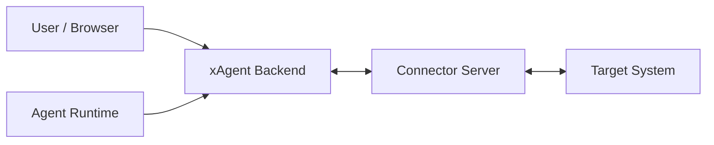

# xAgent Connector Architecture

This document defines architecture boundaries, fact ownership, and lifecycle for xAgent Connectors. For HTTP endpoints, WebSocket packets, JSON fields, state enumerations, and third-party implementation requirements, see the
[xAgent Connector Common Protocol](xagent_connector_protocol.md).

Separate Profile specifications define messages, states, and implementation guidance for individual capabilities:

- [xAgent IM Profile v1](profiles/xagent_im_v1.md)
- [xAgent IM Profile v2](profiles/xagent_im_v2.md)
- [xAgent Device Profile v1](profiles/xagent_device_v1.md)

## 1. Purpose

A Connector is an external-system bridge that runs outside the xAgent process. It projects target-system authentication state, messages, files, and operation capabilities into connections, events, and Tools that xAgent can govern.

A Connector is neither a regular Skill nor an internal xAgent plugin:

- A Skill tells the Agent how to understand events and use Tools.
- Connector Server owns the target-system protocol and authentication state.
- xAgent owns system-level integration facts, the ownership index from users to Connector channels, Tool projection, and SessionEvent conversion.



## 2. Fact Boundaries

| Role | Owns | Does Not Own |
| --- | --- | --- |
| xAgent | Connector catalog, `server_base_url`, system API key, Connector Card and Skill cache, `connector_id`, ownership index between users and `connector_channel_id`, WebSocket routing, Agent Tool projection, SessionEvent conversion, and local governance policy | Target-system authentication state and tokens, target contacts, Connector queues, and Connector file mappings |
| Connector Server | Assignment and validation of `connector_id`, assignment of `connector_channel_id`, target-system authentication state and permissions, Connection Descriptor, Tool execution, inbound-message cache, file references, and target-system protocol details | xAgent user permission model, xAgent Session governance, internal Agent execution, and xAgent persistence schema |
| Agent / LLM | Tools visible in the current Session, Connector Skill, user-visible message content, and business arguments | System API key, `connector_id`, `connector_channel_id`, target-system tokens, transfer tokens, and WebSocket packets |

Boundary principles:

- The xAgent Connector catalog owns `server_base_url`. It is not stored in the Connector Card or determined as a public base URL by local Connector configuration.
- `connector_card_id` and the Connector display name are stable protocol constants chosen during Connector development. Deployers should not rename them at runtime.
- Target-system authentication state remains inside the Connector.
- xAgent stores only Connector-assigned IDs and required projections.
- A Connector does not understand the complete xAgent user permission model. It serves only the `connector_channel_id` values opened by xAgent.
- xAgent does not parse private target-system protocols such as WeChat iLink, OAuth provider APIs, or IMAP details.
- `connector_channel_id` is a routing and binding index, not an authentication credential.

## 3. Core Models

### 3.1 BaseConnector

BaseConnector is the system-level Connector catalog fact in xAgent.

`connectormanageservice` writes it with:

- `connector_card_id`
- `connector_id`
- `name` / `version` / `vendor`
- `server_base_url`
- An encrypted-at-rest system API key
- Protocol and protocol version
- Connector Card snapshot
- Health state and most recent error summary

BaseConnector does not contain target-system accounts, tokens, contacts, or user authentication state.

### 3.2 Connector Card

The Connector Card is the static capability declaration for an unbound Connector.

It answers:

- What the Connector is.
- Its stable `connector_card_id`.
- Which target types, target providers, and Profiles it supports.
- Which real Tools exist.
- Which authentication flows exist.
- How xAgent can generate the basic sign-in UI.

The Card does not indicate whether a user is signed in or whether a Tool is currently available on a channel.

### 3.3 ConnectorClient

xAgent maintains one system-level ConnectorClient for each `connector_card_id`.

Within one xAgent instance, only one Connector Server connection can be registered for a `connector_card_id`. When adding a connection, connectormanageservice checks the Card ID and serializes the write. Editing an existing connection continues to use its original Connector primary key. A second configuration with the same Card ID must not overwrite or coexist with it.

ConnectorClient owns:

- An HTTP client for Card, Skill, health, and transfer endpoints.
- The WebSocket data plane.
- An outbound send queue.
- The current `connector_id`.
- Active `connector_channel_id -> user/session/runtime` routes.

Page refreshes, state reads, Tool calls, and reconnection must reuse the same ConnectorClient instead of creating separate WebSocket connections.

### 3.4 `connector_id`

`connector_id` is the runtime-instance ID assigned by Connector Server during the current data-plane handshake.

Rules:

- xAgent can leave it empty in the first WebSocket `connector.hello`.
- Connector returns the current `connector_id` in `connector.hello.ack`.
- xAgent locates the unique ConnectorClient through the stable `connector_card_id` and stores the current runtime-instance ID.
- A later connection can include the most recent `connector_id`, but Connector Server can issue a new one after cleaning or rebuilding state.
- When the same `connector_card_id` returns a new `connector_id`, xAgent atomically replaces the entire ConnectorClient and closes the old instance. It must not rewrite the ID on the old DataPlane or create a second Connector catalog record.

`connector_id` is not `connector_card_id`.

#### Connector Server Offline Lease

Connector Server must treat xAgent data-plane connectivity as the runtime lease for `connector_id`:

- Start a timer after the final WebSocket that completed hello for the current `connector_id` disconnects. Reconnecting with the same `connector_id` within one hour cancels this expiration.
- After one continuous offline hour, Connector Server unregisters the `connector_id`. A later hello must create a new runtime instance.
- Unregistering `connector_id` forces all subordinate Channels to be unregistered. This timeout cleanup removes target-system authentication state in the Connector and is not the same as a user sending `channel.close`.
- Channel unregistration is an independent action. Each Channel must run its provider-specific sign-out and persistence cleanup path.
- Shared provider consumers, such as a Telegram `bot_token` or Feishu `app_id`, maintain references per target credential. They must stop when the final Channel reference is removed and must remain running while any reference exists.
- If Connector Server restarts and restores persistent Channels but no xAgent data plane completes hello within one hour, those Channels are also treated as having no owning runtime instance and are unregistered.

The three owners are the Connector Server runtime instance, Connector Channel, and shared provider consumer. Removing an upper layer can trigger checks in lower layers, but a lower layer must perform its own reference check instead of relying on an upper-layer timer.

### 3.5 `connector_channel_id`

`connector_channel_id` is a persistent user-level channel ID assigned by the Connector within the namespace of a stable `connector_card_id`.

Rules:

- xAgent sends an empty `connector_channel_id` when opening a user channel for the first time.
- The Connector assigns and returns a new `connector_channel_id`.
- xAgent persists the `user_id + connector_card_id + connector_channel_id` ownership index.
- After xAgent restarts, it reopens persistent channels that remain valid.
- If the Connector cannot recognize an old channel, it can assign and return a new channel. xAgent updates the existing user binding with the new ID.
- Channel routing between xAgent and Connector uses only the top-level `connector_channel_id` in the packet envelope. `UserConnector.ID` and user ownership remain in xAgent's internal mapping.
- `tool.invoke.payload.context` can currently carry `session_id` and `tool_call_id` as correlation information. They are not Connector identities, Channel routes, or authorization input.
- The Connector maps target accounts, platform conversations, and runtime attributes through the same `connector_channel_id`. It does not use an internal xAgent primary key for business ownership.
- The stable `connector_card_id` is the ownership namespace for `connector_channel_id`; it does not change with the Card's current `connector_id`. After a runtime instance is replaced, xAgent restores routing with the original Channel ID.

### 3.6 Connection Descriptor

The Connection Descriptor is a dynamic user-level projection after binding.

It answers:

- Which target-system identity or resource the current channel is bound to.
- The current connection state.
- Which standard and extension Profiles are currently enabled.
- Which `tool_id` values are currently available.

A Descriptor describes only the current channel, not global Connector capabilities. `connection.profiles` must be a non-empty subset of Card `supports.profiles`. A Tool absent from the Card cannot appear in the Descriptor, and an unavailable Tool in the Descriptor cannot be projected to the Agent.

### 3.7 Connector Skill

The Connector Skill gives the Agent runtime guidance for the Connector.

It answers:

- How to understand inbound events.
- Which Tool to use for a reply or operation.
- How to fill Tool arguments.
- Which behavior must not be fabricated.

A Skill stores no state or secrets and does not replace the Card or Descriptor.

## 4. Three Communication Planes

### 4.1 Control Plane

The Control Plane handles system-level HTTP reads and health checks:

- Read the Connector Card.
- Read the Connector Skill.
- Probe Connector health.

The Control Plane does not execute user-level Tools or transfer file content.

### 4.2 Data Plane

The Data Plane is a WebSocket packet bus. It handles:

- System-level `connector.hello`.
- Opening and closing user channels.
- User authentication flows.
- Descriptor synchronization.
- `tool.invoke`.
- Inbound `message.push`.
- `chat.message`, `chat.message.delta`, `chat.message.ack`, and `chat.activity` after `xagent.im.v2` is declared.
- `ping`, `pong`, and error responses.

The Data Plane carries only structured packets, not file content, base64, or target-system CDN byte streams.

`xagent.im.v2` is a Data Plane Profile for `target_type=im`, not a fourth communication plane. It transports complete chat messages, real-time assistant text deltas, delivery acknowledgments, and redacted activity state. A complete message can include a Transfer Plane `file_ref`, but not file bytes. Interrupt, approval, pending, and Browser Runtime signaling do not belong to IM v2. Internal xAgent Session synchronization, history replay, and UI projection are not Connector extension capabilities and must not be forwarded through any Connector Profile. A Connector must support both optional assistant deltas and final messages. If the target system supports streaming display, it can update a target message in real time; otherwise it caches deltas locally and sends once after the final message arrives. Files arrive only with the final message.

#### Virtual Connector Message Channel Boundary

xAgent registers a virtual message channel for a successfully negotiated real-time messaging Profile only to connect the Connector to the same Brain processing chain as other real-time message inputs. An IM Connector uses `xagent.im.v2`; Browser Runtime uses its own versioned Profile. This virtual channel is a transport adapter, not a UI Channel or general Session client.

Implementations must follow these rules:

- A Connector -> xAgent `chat.message` represents exactly one new user input. After validation and routing, it enters the current Session's unified Brain processing chain directly.
- Connector -> xAgent images, videos, audio, and files are registered as unified files through `download_url`, then enter Brain as regular file blocks on the same user message. Internal Connector upload references must not appear in prompt text, a Skill, or model Tool arguments.
- xAgent -> Connector `chat.message.delta`, final `chat.message`, and optional `chat.activity` originate only from the current real-time execution. Each newly persisted assistant message completes with its own final `chat.message`, regardless of whether it appears before or after Tool calls. Here, "final" means one message completed, not that the full Agent and Tool loop can send only its last response. Delivery must not be triggered by Session history queries, history traversal, or synchronization projections.
- xAgent uploads assistant file blocks through the Transfer Plane before sending them to Connector. The final `chat.message.files` contains only Connector-returned references. Text and all files share one `message_id` and ack lifecycle.
- `session.sync_request`, `session.sync_message`, `session.sync_end`, and equivalent history, snapshot, replay, and UI projections serve only xAgent's own UI and Session Channels. They must not be written to a virtual Connector message channel.
- Reconnecting a virtual message channel restores only real-time routing and unfinished delivery for the current `connector_channel_id`; it does not replay completed Session messages.
- A virtual Connector message packet does not accept `SessionID`, `UserConnector.ID`, internal message roles, or history cursors. xAgent retains those facts and routes internally through the current Channel binding. Separately, `tool.invoke` can include non-authoritative correlation information in `payload.context.session_id`.

ChannelService must distinguish UI Session projection from Connector real-time messages before writing to a transport. It must not rely on the Connector to ignore an internal Envelope after receiving it. The protocol layer provides a structured capability catalog for every standard Profile, declaring packets, directions, routing boundaries, and permitted outbound xAgent `PayloadType` values. After negotiation, the intersection is loaded into an immutable query object. A virtual Connector message channel can query only that object; it must not hard-code Profile switches or signaling allowlists. When negotiated Profiles in the Descriptor change, the channel must be replaced and reloaded. Signals absent from both the catalog and the current negotiated result are silently filtered by the virtual channel. ConnectorManageService owns only Connector transport, acknowledgment, and retry state; it does not own Session history facts.

The built-in Browser Runtime uses a separate versioned physical connection protocol. The current client connects with Envelope v2 and `protocol_version: "2.0"`; xAgent continues to accept Envelope v1 clients that omit a version. The Connection Descriptor projects only Browser Runtime Profiles supported by the current connection and does not declare `xagent.im.v2`. Browser Runtime v1 and v2 own their required `chat.message`, `chat.message.delta`, and `chat.message.ack` routes. In addition, v2 receives a complete snapshot of content, reasoning, and streaming state for the same assistant message through `browser.chat.message.snapshot`.

### 4.3 Transfer Plane

The Transfer Plane handles byte streams for files, images, and videos:

- xAgent backend uploads an outbound file to Connector and receives a `file_ref`.
- xAgent backend downloads an inbound file from Connector.
- Connector owns the mapping from `file_ref` to a target-system file or local cache and its expiration policy.

The frontend, Agent, and LLM hold only xAgent's unified `file_ref`. They must not directly hold an internal Connector upload reference, system API key, target-system CDN token, or temporary download key.

## 5. Standard Lifecycle

### 5.1 Integrate a Connector

```text
Admin enters the Connector Base URL and optional API key
xAgent fetches /connector-card.json
xAgent fetches /skill.md
xAgent probes /health
xAgent stores BaseConnector, the Card snapshot, and the Skill cache
xAgent registers the Connector Tool runtime
```

Integration creates only system-level Connector facts. It does not create a user channel automatically.

### 5.2 Establish the System Connection

```text
xAgent opens the /ws data plane
xAgent -> connector.hello(connector_card_id, connector_id?, protocol_version, supported_profiles)
Connector -> connector.hello.ack(connector_id, protocol_version)
xAgent validates and stores connector_id
```

No user-level packet can be sent before `connector.hello.ack` completes.

The Connector calculates Profiles enabled for each Channel as the intersection of `supported_profiles` and static Card capabilities, then returns them in the Connection Descriptor. If an older xAgent does not declare this field, newly added Profile signals must not be enabled implicitly.

### 5.3 Open a User Channel

```text
User selects Connect
xAgent -> channel.open(connector_channel_id = "")
Connector -> channel.open.ack(connector_channel_id, connection_descriptor)
xAgent temporarily retains unauthenticated Channel runtime state
xAgent -> auth.start / auth.status
Connector -> authenticated + connection_descriptor
xAgent creates the UserConnector and dedicated Session aggregate
```

On first creation, `channel.open` creates only temporary authentication context and does not write the UserConnector table. If authentication is canceled or the dialog closes, xAgent closes the temporary channel and releases the context. The Channel and its dedicated Session are persisted only after authentication succeeds and a `connection_descriptor` is obtained.

For a persistent channel, the page submits only `UserConnector.ID`. xAgent reads the latest record by that primary key, resolves the current Connector through the record's `connector_card_id`, and reopens it with the stored `connector_channel_id`. If the Connector recognizes the channel, it reuses it. Otherwise, it allocates and returns a new ID. xAgent always updates the original UserConnector primary key instead of creating another record.

### 5.4 User Authentication

Authentication must run on an open channel.

```text
xAgent -> auth.start(flow_id)
Connector -> auth.start.ack(...)
xAgent -> auth.status(auth_session_id, refresh?)
Connector -> auth.status.ack(...)
Connector -> connection.descriptor.push(optional)
```

Authentication state belongs to the authentication flow; `connection.status` in the Connection Descriptor belongs to the user connection projection. The latest Descriptor corrects the final UI state.

`auth.cancel` cancels only an unfinished authentication session; it does not sign out of the target system.

### 5.5 Tool Invocation

```text
Agent invokes a Connector Tool
xAgent wraps tool.invoke for the current user and channel
Connector executes the target-system operation
Connector -> tool.invoke.ack(result or error)
```

During Tool invocation:

- `tool_id` must come from the Connector Card.
- An official Connector injects required `connector_channel_id` into the Tool input schema when building the Card, so the LLM can see and fill the field.
- xAgent currently does not select a Channel from the model's `connector_channel_id` argument. A dedicated Connector Session uses its fixed binding first; without such a binding, xAgent selects the first authenticated and available Channel for the same Connector Card that provides the Tool.
- xAgent writes the selected Channel ID to the packet envelope. Model arguments enter `payload.arguments` unchanged, and their `connector_channel_id` does not override envelope routing.
- The Connector routes only by the top-level `connector_channel_id` in the envelope. The business Tool does not consume the same-named argument.
- The Connector must validate Tool availability against target-system permissions on the current channel.
- A business failure returns `tool.invoke.ack.error`.
- A protocol, identity, or routing error returns `type = error`.

### 5.6 Inbound Messages

The Connector receives messages from the target system and pushes them to xAgent.

```text
Connector receives a target-system message
Connector assumes responsibility according to the Profile's delivery semantics
If the channel is open, Connector -> xAgent
xAgent returns the delivery result through a public packet
Connector completes, retries, or waits for expiration according to the result
```

Connector owns target-message acceptance, redelivery, and expiration, but the protocol does not require a local file, database, or message queue. For external guarantees and recommendations for current IM messages, see [xAgent IM Profile v2](profiles/xagent_im_v2.md). [IM Profile v1](profiles/xagent_im_v1.md) exists only for legacy `message.push` compatibility.

### 5.7 Close and Sign Out

`channel.close` and `auth.logout` are separate actions:

- `channel.close` closes only the current runtime channel route. It does not delete xAgent's persistent binding or target-system authentication state in Connector.
- `auth.logout` asks Connector to clear target-system authentication state. After success, xAgent retains UserConnector and the dedicated Session, marks them unauthenticated, and removes the runtime route so the user can authenticate again after editing credentials.
- Permanently deleting UserConnector and the dedicated Session is a separate explicit delete action, not part of sign-out semantics.

## 6. Relationship Between Card, Descriptor, and Skill

These responsibilities must not be mixed:

| Object | Nature | Lifecycle | Content |
| --- | --- | --- | --- |
| Connector Card | Static capability catalog | Read during integration and refreshed when the version changes | Connector identity, target and Profile support, auth flows, and real Tool schemas |
| Connection Descriptor | User-level runtime projection | Refreshed during channel.open, auth, status, and push | Current channel state, target-account display, and Tool availability |
| Connector Skill | Agent behavior guidance | Downloaded during integration and refreshed when the version changes | How to handle events, use Tools, and avoid fabricated behavior |

## 7. Tool Projection

Connector Tools are dynamic runtime projections, not permanent global Tools.

xAgent projection flow:

1. Read Tool definitions from the Connector Card.
2. Read current-channel Tool state from the Connection Descriptor.
3. Apply local xAgent governance policy.
4. Inject only Tools available to the current user and current Session into Agent runtime.

Rules:

- A Tool exposed by Connector must actually exist.
- A future capability that currently returns 404 must not appear in the Card.
- A Connector must not fabricate target-system capabilities such as contact search or file search.
- The LLM sees `tool_id + description + schema`.
- Official Connector Tool schemas include model-visible `connector_channel_id`. System API keys and target-system tokens are never visible.
- When the current Session is bound to a Connector Channel, only that binding is used. Without a binding, xAgent traverses Channels available to the current user and selects the first one matching the Connector Card and providing the Tool.

## 8. Inbound Message Model

A Connector emits messages according to the common protocol and declared Profiles. It does not need to understand xAgent's internal Session, Agent, or event model.

The common protocol defines the public `message.push` packet, and [xAgent IM Profile v1](profiles/xagent_im_v1.md) exists only for xAgent compatibility with legacy Connectors. Current IM Connectors use [xAgent IM Profile v2](profiles/xagent_im_v2.md) for bidirectional finals, deltas, acks, activity, file references, and IM Tool ownership.

## 9. Files and Resource References

Connector file model:

```text
Target-system file / Connector local cache
  -> file_ref
  -> download_url
  -> xAgent ResourceRef
  -> Session attachment / Workspace file
  -> Agent-readable file
```

Rules:

- Connector downloads or caches an inbound file promptly to avoid target-system CDN expiration.
- `file_ref` is an internal opaque Connector key.
- `download_url` can be absolute or relative. xAgent resolves a relative URI through `server_base_url` from the catalog.
- Only xAgent backend or a resource resolver consumes `download_url`.
- xAgent can resolve a Connector file into a local Session file and include it as a regular file in a multimodal model request.
- xAgent can upload a Session file from an assistant message to Connector and reference the returned `file_ref` in final `chat.message.files`.
- Large files do not travel through WebSocket, Tool arguments, or base64.

Voice-message interpretation belongs to Connector:

- If the target system supplies a voice transcript, Connector can push it as a text message.
- If the target system cannot interpret it, Connector should not force xAgent to perform ASR. It can handle the item as a regular file or an uninterpretable event.

## 10. State, Cache, and Recovery

xAgent persists:

- BaseConnector.
- Connector Card snapshot.
- Connector Skill cache.
- `connector_id`.
- The `user_id + connector_card_id + connector_channel_id` ownership index.
- Most recent user authentication state, activation state, and error summary for initial UI display and state correction.

xAgent does not persist:

- Temporary Channel authentication context after the first `channel.open` and before successful authentication.
- Target-system authentication state.
- Target-system tokens.
- Connection Descriptor as a long-lived target-system fact.
- Target-system contacts.
- Connector pending-message queue.
- Connector file-mapping facts.

Connector owns:

- Target-system authentication state or authorization material.
- The persistent binding from `connector_card_id + connector_channel_id` to a target identity and the current `connector_id` runtime ownership of those Channels.
- Retention, redelivery, expiration, and capacity policy for inbound messages.
- Target-system consumer cursor or equivalent replay capability.
- The mapping from file `file_ref` to local cache path.

Connector can implement these responsibilities through local storage, an external database, a message queue, or the target system's reliable cursor. Profiles provide recommendations for exact TTL, capacity, cleanup interval, and internal concurrency model; they are not part of the common wire contract.

Recovery rules:

- After xAgent restarts, it restores valid channels concurrently from persistent UserConnectorState.
- After Connector restarts, it must restore target-system identities and channel bindings that remain valid across the boundary. The declared Profile defines whether and how messages recover.
- Connector must not treat a message as successfully delivered while its channel is closed.
- A Profile that retains messages must define finite expiration and capacity semantics without prescribing a storage implementation.
- The xAgent data plane reconnects automatically. After consecutive failures reach the limit, automatic retry stops until user or administrator action triggers recovery.

## 11. Security Constraints

Implementations must follow these rules:

1. The system API key exists only between xAgent backend and Connector Server.
2. A target-system token exists only inside Connector.
3. The frontend, Agent, Skill, Card, Descriptor, Tool arguments, and message payload must not contain a system API key or target-system token.
4. Neither `connector_channel_id` nor `request_id` is an authentication credential.
5. Connector must validate the system connection identity, `connector_id`, `connector_channel_id`, and Tool permission.
6. A Connector Card can be public but must not contain a secret, one-time QR code, OAuth state, target-system authentication state, or real sensitive identity.
7. A Connection Descriptor can contain only display-level account information and redacted hints.
8. A side-effecting Tool must provide idempotency or repeated-call detection.
9. A Tool result returned by Connector must not contain a target-system token, bot token, context token, or API key.
10. Logs must not contain a system API key, target-system token, temporary download key, or raw target-system CDN signature.

## 12. Versioning and Compatibility

`connector.version` identifies the capability version of the Connector Card and Connector implementation.

Protocol version identifies the xAgent Connector protocol version.

Compatibility rules:

- The Connector Card declares only the Connector's current `protocol_version`. Minimum compatibility is a local xAgent admission policy and does not appear in the Card.
- xAgent admits only a Connector whose version falls between xAgent's minimum compatible version and current version. Peers report their current versions during hello; they do not exchange version lists.
- Low-level parsers can still recognize legacy objects that omit `protocol_version` and normalize a v1 Connection Descriptor into the current internal `Profiles []string` model.
- The current catalog and official Connectors reject protocol versions below `3.0`. An official Connector does not emit a v1 Descriptor to an old peer.
- Adding an optional field generally requires only a `connector.version` increment.
- Adding a Tool, auth flow, Profile, or Skill content also increments `connector.version`.
- Removing a Tool, changing `tool_id`, changing existing field semantics, or making an optional argument required is a breaking change.
- Changing the packet envelope, ID validation rules, required packets, or core state semantics requires a Protocol version increment.
- When xAgent detects a `connector.version` change, it should refetch the Card and Skill and refresh Tool projection.
